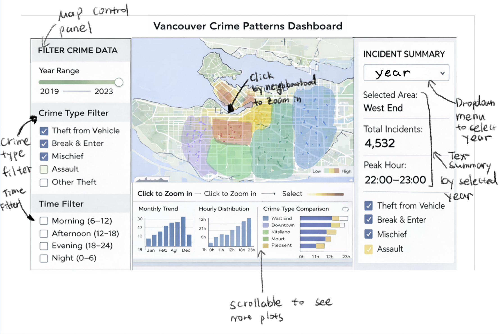

# Dashboard Design

### Description
The Vancouver Crime Patterns Dashboard is an interactive visualization tool designed to help users explore long-term crime trends across neighbourhoods in Vancouver. The interface is organized into three main sections: a filter panel on the left, an interactive map in the center, and an incident summary panel on the right, with additional analytical charts displayed below.

The left filter panel allows users to control the displayed data using a year range slider, crime type checkboxes, and time-of-day filters. These controls enable users to focus on specific time periods, incident categories, and daily patterns. A reset option is provided to quickly restore default settings.

The central panel displays a geographic heatmap of Vancouver, showing the spatial distribution of crime incidents by neighbourhood. Users can click on individual neighbourhoods to zoom in and select areas of interest. Map selections dynamically update all linked views in the dashboard, supporting coordinated exploration across visualizations.

The right summary panel presents key statistics for the selected year and neighbourhood, including total incidents, peak crime hours, and the distribution of crime types. This panel provides a concise overview that complements the visual analysis.

Below the map, a scrollable analytics section contains multiple linked charts, including monthly trends, hourly distributions, and neighbourhood comparisons. These charts update automatically based on user selections, allowing users to examine temporal and spatial patterns simultaneously.

Overall, the dashboard emphasizes interactive filtering, coordinated views, and clear summaries to support exploratory analysis and data-driven decision-making.

