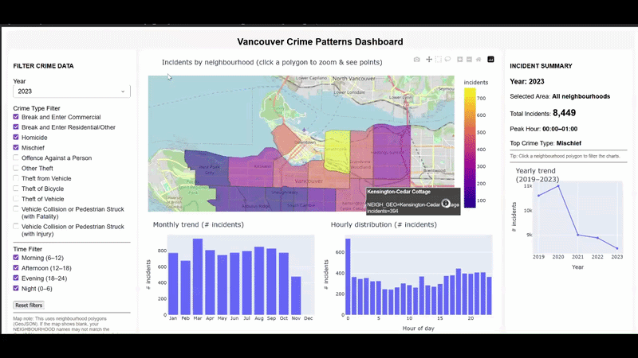

# Vancouver Crime Patterns Dashboard

An interactive visualization tool for exploring long-term crime trends across Vancouver neighbourhoods using coordinated maps, filters, and analytical charts.


## Live Dashboard:
https://data-551-group8-project.onrender.com/
---

## Table of Contents

- [Vancouver Crime Patterns Dashboard](#vancouver-crime-patterns-dashboard)
  - [Table of Contents](#table-of-contents)
  - [Overview](#overview)
  - [Motivation](#motivation)
  - [Features](#features)
    - [Interactive Filters](#interactive-filters)
    - [Interactive Map](#interactive-map)
    - [Summary Panel](#summary-panel)
    - [Linked Analytical Charts](#linked-analytical-charts)
  - [Deployment](#deployment)
  - [Technology Stack](#technology-stack)
  - [Getting Started (Local Setup)](#getting-started-local-setup)
    - [1. Clone the repository](#1-clone-the-repository)
    - [2. Install dependencies](#2-install-dependencies)
    - [3. Run the app](#3-run-the-app)
    - [4. Open in browser if using Bash](#4-open-in-browser-if-using-bash)
  - [Project Structure](#project-structure)
  - [Contributing](#contributing)
    - [Steps:](#steps)
  - [License](#license)

---

## Overview

The Vancouver Crime Patterns Dashboard is designed to help users explore spatial and temporal crime trends across Vancouver neighbourhoods.

The interface consists of:
- A **filter panel** (left)
- An **interactive map** (center)
- A **summary statistics panel** (right)
- A **scrollable analytics section** (bottom)

All components are dynamically linked to support coordinated and interactive data exploration.

---

## Motivation

Crime data is publicly available but often difficult to interpret due to its size, complexity, and lack of intuitive visualization tools. This project aims to:

- Make crime data more accessible and understandable
- Enable spatial exploration across neighbourhoods
- Reveal temporal trends (yearly, monthly, hourly)
- Support data-driven insights for residents, researchers, and policymakers

By combining geographic visualization with interactive filtering and statistical summaries, this dashboard helps users identify meaningful crime patterns quickly and effectively.

---

## Features

### Interactive Filters
- Year range slider
- Crime type checkboxes
- Time-of-day selection
- Reset button for restoring default settings

### Interactive Map
- Neighbourhood-level heatmap
- Click-to-zoom functionality
- Dynamic updates across all visualizations
- Back button to zoom out, can also click on point to zoom out

### Summary Panel
- Total incidents
- Peak crime hours
- Yearly Trends

### Linked Analytical Charts
- Monthly crime trends
- Hourly incident distribution
- Crime type counts

All views update automatically based on selected filters and map interactions.

---

## Deployment
 
[Deployment Link](https://data-551-group8-project.onrender.com/)

---

## Technology Stack

- Python
- Dash
- Plotly
- Pandas
- GeoJSON (for neighbourhood boundaries)

---

## Getting Started (Local Setup)

### 1. Clone the repository

```bash
git clone https://github.com/your-username/vancouver-crime-dashboard.git
cd vancouver-crime-dashboard
```

### 2. Install dependencies

```bash
pip install -r requirements.txt
```

### 3. Run the app

```bash
python app.py
```
Or Run cell in TestNotebook.ipynb

### 4. Open in browser if using Bash

```
http://127.0.0.1:8050/
```

---

## Project Structure

```
├── app.py
├── data/
│   └── crime_data.csv
├── components/
│   ├── filters.py
│   ├── map.py
│   └── charts.py
├── img/
│   └── dashboard.png
├── requirements.txt
└── README.md
```

---

## Contributing

Contributions are welcome!

### Steps:
1. Fork the repository
2. Create a new branch  
   ```bash
   git checkout -b feature-name
   ```
3. Commit your changes
4. Push to your fork
5. Submit a Pull Request

Please ensure:
- Code is documented
- Functions are modular
- Visualizations remain consistent with the dashboard design

If you're unsure where to start, feel free to open an issue to discuss ideas.

---

## License

This project is for academic and educational purposes.
License in LICENSE.  
